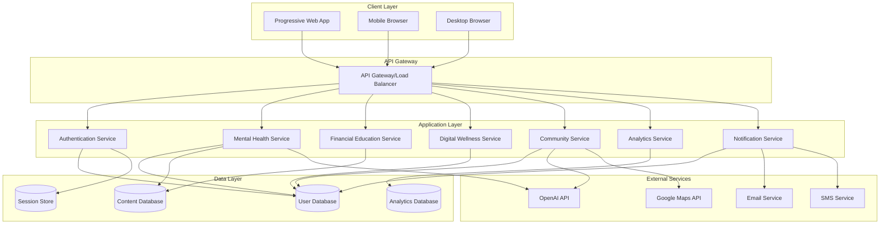

# Design Document - MindConnect Platform

## Overview

MindConnect adalah platform web progresif (PWA) yang dirancang dengan arsitektur modular untuk mendukung skalabilitas dan maintainability. Platform ini mengintegrasikan empat zona utama (Kesehatan Mental, Edukasi Finansial, Manajemen Teknologi, dan Akses & Inklusi) dalam satu ekosistem yang kohesif dengan fokus pada user experience yang aman dan engaging untuk remaja.

## Architecture

### High-Level Architecture



### Technology Stack

**Frontend:**
- Next.js 14+ dengan TypeScript untuk full-stack React framework
- Tailwind CSS untuk styling yang konsisten dan responsive
- PWA capabilities dengan next-pwa untuk offline functionality
- TanStack Query (React Query) untuk state management dan caching
- Next.js App Router untuk navigation dan routing
- Chart.js untuk visualisasi data analytics

**Backend:**
- Node.js dengan Express.js framework
- TypeScript untuk consistency dengan frontend
- JWT untuk authentication dan session management
- Socket.io untuk real-time features (live chat, notifications)
- Multer untuk file upload handling

**Database:**
- MySQL 8.0+ sebagai primary database untuk data relational
- Redis untuk session storage dan caching
- MySQL JSON data type untuk content yang semi-structured (jurnal entries, forum posts)

**Infrastructure:**
- Docker containers untuk deployment consistency
- AWS/Vercel untuk hosting dan CDN
- Cloudflare untuk security dan performance
- GitHub Actions untuk CI/CD pipeline

## Components and Interfaces

### 1. Authentication System

**Components:**
- `AuthProvider`: Context provider untuk authentication state
- `LoginForm`: Form login dengan validation
- `RegisterForm`: Form registrasi dengan email verification
- `PasswordReset`: Flow reset password
- `ProfileManager`: Manajemen profil pengguna

**Key Interfaces:**
```typescript
interface User {
  id: string;
  email: string;
  username: string;
  dateOfBirth: Date;
  preferences: UserPreferences;
  createdAt: Date;
  lastActive: Date;
}

interface UserPreferences {
  notifications: NotificationSettings;
  privacy: PrivacySettings;
  accessibility: AccessibilitySettings;
}
```

### 2. Mental Health Zone

**Components:**
- `SelfAssessment`: Interactive assessment tools dengan scoring
- `EmotionalJournal`: Rich text editor untuk jurnal harian
- `MindfulnessPlayer`: Audio/video player untuk guided meditation
- `AnonymousForum`: Forum dengan moderation system
- `PsychologistChat`: Real-time chat interface
- `MoodTracker`: Visual mood tracking dengan charts

**Key Interfaces:**
```typescript
interface AssessmentResult {
  id: string;
  userId: string;
  type: 'stress' | 'depression' | 'anxiety';
  score: number;
  recommendations: string[];
  completedAt: Date;
}

interface JournalEntry {
  id: string;
  userId: string;
  content: string;
  mood: MoodLevel;
  triggers: string[];
  isPrivate: boolean;
  createdAt: Date;
}
```

### 3. Financial Education Zone

**Components:**
- `FinancialSimulator`: Interactive game-based learning
- `MicroLearningModule`: Bite-sized educational content
- `FinancialCalculator`: Tools untuk budgeting dan savings
- `ProgressTracker`: Visual progress dalam financial literacy
- `BadgeSystem`: Gamification untuk motivasi

**Key Interfaces:**
```typescript
interface SimulationSession {
  id: string;
  userId: string;
  scenario: string;
  decisions: Decision[];
  score: number;
  completedAt: Date;
}

interface LearningProgress {
  userId: string;
  moduleId: string;
  completionPercentage: number;
  lastAccessed: Date;
  certificateEarned: boolean;
}
```

### 4. Digital Wellness Zone

**Components:**
- `ScreenTimeTracker`: Integration dengan browser APIs untuk tracking
- `DigitalDetoxChallenge`: Challenge system dengan progress tracking
- `DigitalLiteracyQuiz`: Interactive quizzes tentang online safety
- `UsageAnalytics`: Visualisasi pola penggunaan digital
- `GoalSetting`: Interface untuk set dan track digital wellness goals

**Key Interfaces:**
```typescript
interface ScreenTimeData {
  userId: string;
  date: Date;
  totalMinutes: number;
  appBreakdown: AppUsage[];
  goals: DigitalGoal[];
}

interface DetoxChallenge {
  id: string;
  userId: string;
  type: '7day' | '14day' | '30day';
  startDate: Date;
  currentStreak: number;
  isActive: boolean;
}
```

### 5. Community and Support System

**Components:**
- `ServiceMap`: Interactive map dengan location-based services
- `OpportunityFeed`: Curated list of scholarships dan opportunities
- `PeerSupport`: Peer-to-peer support matching system
- `ResourceLibrary`: Searchable library of mental health resources
- `CrisisSupport`: Emergency support system dengan hotline integration

## Data Models

### Core Data Models

```sql
-- Users table
CREATE TABLE users (
    id CHAR(36) PRIMARY KEY DEFAULT (UUID()),
    email VARCHAR(255) UNIQUE NOT NULL,
    username VARCHAR(50) UNIQUE NOT NULL,
    password_hash VARCHAR(255) NOT NULL,
    date_of_birth DATE,
    created_at TIMESTAMP DEFAULT CURRENT_TIMESTAMP,
    last_active TIMESTAMP,
    is_verified BOOLEAN DEFAULT FALSE,
    preferences JSON,
    INDEX idx_email (email),
    INDEX idx_username (username)
);

-- Assessment results
CREATE TABLE assessment_results (
    id CHAR(36) PRIMARY KEY DEFAULT (UUID()),
    user_id CHAR(36) NOT NULL,
    assessment_type VARCHAR(50) NOT NULL,
    score INTEGER NOT NULL,
    responses JSON NOT NULL,
    recommendations JSON,
    completed_at TIMESTAMP DEFAULT CURRENT_TIMESTAMP,
    FOREIGN KEY (user_id) REFERENCES users(id) ON DELETE CASCADE,
    INDEX idx_user_assessment (user_id, assessment_type),
    INDEX idx_completed_at (completed_at)
);

-- Journal entries
CREATE TABLE journal_entries (
    id CHAR(36) PRIMARY KEY DEFAULT (UUID()),
    user_id CHAR(36) NOT NULL,
    content TEXT NOT NULL,
    mood_level INTEGER CHECK (mood_level >= 1 AND mood_level <= 10),
    triggers JSON,
    is_private BOOLEAN DEFAULT TRUE,
    created_at TIMESTAMP DEFAULT CURRENT_TIMESTAMP,
    FOREIGN KEY (user_id) REFERENCES users(id) ON DELETE CASCADE,
    INDEX idx_user_entries (user_id, created_at),
    INDEX idx_mood_level (mood_level)
);

-- Financial progress
CREATE TABLE financial_progress (
    id CHAR(36) PRIMARY KEY DEFAULT (UUID()),
    user_id CHAR(36) NOT NULL,
    module_id VARCHAR(100) NOT NULL,
    completion_percentage INTEGER DEFAULT 0,
    score INTEGER,
    last_accessed TIMESTAMP DEFAULT CURRENT_TIMESTAMP,
    certificate_earned BOOLEAN DEFAULT FALSE,
    FOREIGN KEY (user_id) REFERENCES users(id) ON DELETE CASCADE,
    UNIQUE KEY unique_user_module (user_id, module_id),
    INDEX idx_completion (completion_percentage),
    INDEX idx_last_accessed (last_accessed)
);

-- Screen time data
CREATE TABLE screen_time_logs (
    id CHAR(36) PRIMARY KEY DEFAULT (UUID()),
    user_id CHAR(36) NOT NULL,
    date DATE NOT NULL,
    total_minutes INTEGER NOT NULL,
    app_breakdown JSON,
    created_at TIMESTAMP DEFAULT CURRENT_TIMESTAMP,
    FOREIGN KEY (user_id) REFERENCES users(id) ON DELETE CASCADE,
    UNIQUE KEY unique_user_date (user_id, date),
    INDEX idx_date (date),
    INDEX idx_total_minutes (total_minutes)
);

-- Community posts
CREATE TABLE community_posts (
    id CHAR(36) PRIMARY KEY DEFAULT (UUID()),
    user_id CHAR(36) NOT NULL,
    category VARCHAR(50) NOT NULL,
    title VARCHAR(200) NOT NULL,
    content TEXT NOT NULL,
    is_anonymous BOOLEAN DEFAULT TRUE,
    is_moderated BOOLEAN DEFAULT FALSE,
    created_at TIMESTAMP DEFAULT CURRENT_TIMESTAMP,
    FOREIGN KEY (user_id) REFERENCES users(id) ON DELETE CASCADE,
    INDEX idx_category (category),
    INDEX idx_created_at (created_at),
    INDEX idx_moderated (is_moderated)
);
```

## Error Handling

### Error Classification

1. **Client Errors (4xx)**
   - Validation errors dengan specific field feedback
   - Authentication/authorization errors
   - Rate limiting errors

2. **Server Errors (5xx)**
   - Database connection errors
   - External API failures
   - Unexpected application errors

### Error Response Format

```typescript
interface ErrorResponse {
  error: {
    code: string;
    message: string;
    details?: any;
    timestamp: string;
    requestId: string;
  };
}
```

### Error Handling Strategy

- **Graceful Degradation**: Fitur non-critical tetap berfungsi meski ada error
- **Retry Logic**: Automatic retry untuk transient errors
- **User-Friendly Messages**: Error messages yang mudah dipahami remaja
- **Logging**: Comprehensive error logging untuk debugging
- **Monitoring**: Real-time error monitoring dengan alerts

## Testing Strategy

### Testing Pyramid

1. **Unit Tests (70%)**
   - Jest untuk JavaScript/TypeScript testing
   - React Testing Library untuk component testing
   - Supertest untuk API endpoint testing
   - Coverage target: 80%+

2. **Integration Tests (20%)**
   - Database integration testing
   - API integration testing
   - Third-party service integration testing

3. **End-to-End Tests (10%)**
   - Playwright untuk browser automation
   - Critical user journeys testing
   - Cross-browser compatibility testing

### Testing Environments

- **Development**: Local testing dengan mock data
- **Staging**: Production-like environment untuk integration testing
- **Production**: Monitoring dan health checks

### Security Testing

- **Authentication Testing**: JWT validation, session management
- **Authorization Testing**: Role-based access control
- **Input Validation**: SQL injection, XSS prevention
- **Privacy Testing**: Data anonymization, GDPR compliance
- **Penetration Testing**: Regular security audits

### Performance Testing

- **Load Testing**: Concurrent user simulation
- **Stress Testing**: System breaking point identification
- **Performance Monitoring**: Real-time performance metrics
- **Mobile Performance**: Lighthouse audits untuk PWA optimization

## Security Considerations

### Data Protection

- **Encryption**: AES-256 untuk data at rest, TLS 1.3 untuk data in transit
- **Anonymization**: Automatic PII anonymization untuk forum posts
- **Data Retention**: Automatic data purging sesuai retention policy
- **Backup Security**: Encrypted backups dengan access controls

### Privacy by Design

- **Minimal Data Collection**: Hanya collect data yang necessary
- **User Consent**: Clear consent mechanisms untuk data usage
- **Data Portability**: Export functionality untuk user data
- **Right to Deletion**: Complete data deletion capability

### Access Control

- **Role-Based Access**: User, Moderator, Admin, Psychologist roles
- **API Rate Limiting**: Prevent abuse dan DDoS attacks
- **Session Management**: Secure session handling dengan timeout
- **Multi-Factor Authentication**: Optional 2FA untuk enhanced security

## Scalability and Performance

### Horizontal Scaling

- **Microservices Architecture**: Independent service scaling
- **Load Balancing**: Distribute traffic across multiple instances
- **MySQL Read Replicas**: Read replicas untuk improved query performance
- **CDN Integration**: Global content delivery untuk static assets

### Caching Strategy

- **Redis Caching**: Session data dan frequently accessed content
- **Browser Caching**: Static assets dengan appropriate cache headers
- **API Response Caching**: Cache expensive database queries
- **Service Worker Caching**: Offline functionality untuk PWA

### Performance Optimization

- **Code Splitting**: Lazy loading untuk reduced initial bundle size
- **Image Optimization**: WebP format dengan fallbacks
- **MySQL Query Optimization**: Optimized queries dengan proper indexes dan query analysis
- **Monitoring**: Real-time performance monitoring dengan alerts